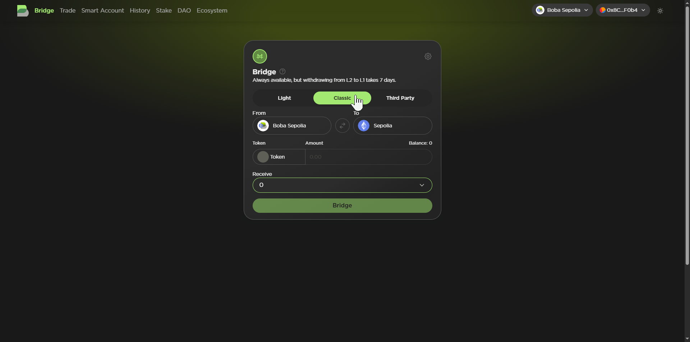
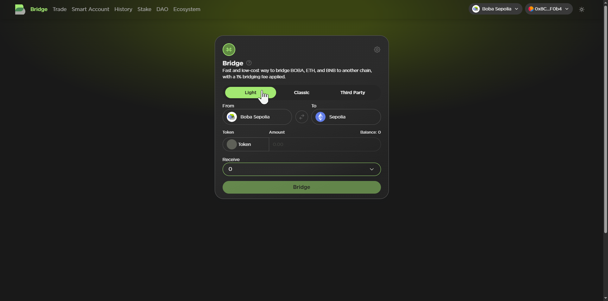
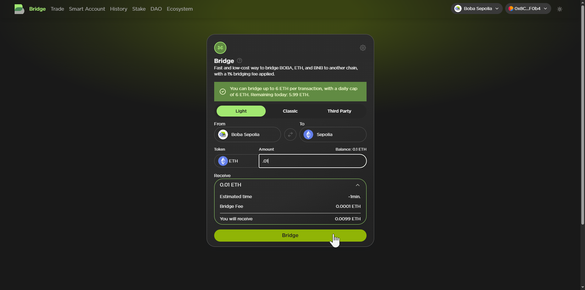

# Bridging

Bridging is the process of transferring assets between different blockchain networks. It enhances interoperability among various networks, currently including Ethereum, Sepolia, Boba (ETH and Sepolia), and many others.

Transferring tokens or data between any of these networks allows you to leverage each of their dApps, ecosystems, and other resources.

Boba currently supports two kinds of bridging: classic and light.

## Classic Bridging

Classic bridging has low fees but perhaps more of a wait time. Bridging assets in (from Layer 1 to Layer 2) usually takes just 10-15 minutes, but bridging out (from Layer 2 to Layer 1) requires seven days.

## Light Bridging

Light bridging has higher fees (1% of the transferred assets), but is very fast, taking just a minute or two in either direction.

## How to Bridge

Whichever style of bridge you decide to use, simply select the networks you wish to bridge from and to, and the amount of which token you wish to transfer. Boba will estimate your wait time and bridge fee for you. Once the tokens have been transferred, you can verify from your wallet that the transaction was successful.

Once you feel comfortable, get started bridging [here](https://hub.boba.network/bridge)!
